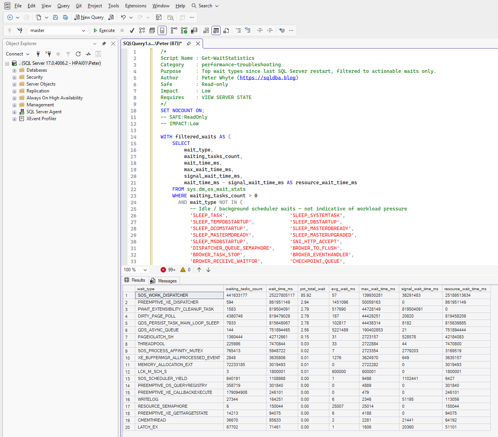

<p align="center">
  
</p>

<h3 align="center">SQL Server Diagnostic & Operational Scripts for Production DBAs</h3>

<p align="center">
  <a href="https://github.com/peterwhyte-lgtm/dba-tools"></a>
  <a href="LICENSE"></a>
  <a href="https://github.com/peterwhyte-lgtm/dba-tools/commits/main"></a>
  <a href="https://sqldba.blog"></a>
</p>

---

## Start Here

Clone the repo and run the setup script. This assumes a local SQL Server is installed, no flags needed:

```powershell
git clone https://github.com/peterwhyte-lgtm/dba-tools
cd dba-tools
.\Initialize-Environment.ps1
```

This checks PowerShell version, installs the SqlServer module if missing, creates output directories, and verifies the connection. Pass or fail, it tells you exactly what to do next.

<p align="center">
  
</p>

To target a remote or named instance instead, pass `-ServerInstance`:

```powershell
.\Initialize-Environment.ps1 -ServerInstance PROD01\SQL2025
```

Once setup passes the server is saved for the session, every script picks it up automatically, no `-ServerInstance` flag needed on each run.

> Full prerequisites and troubleshooting: [SETUP.md](SETUP.md)

---

## What This Is

You're mid-incident. Blocking is taking down an application, a backup question just landed from management, or a migration window opens in two hours and you still need to know what's on the source server. You know what you need to look at — you just need the query in front of you, fast.

This is a copy-paste toolkit for production SQL Server DBAs. SQL scripts you open and paste directly into SSMS. PowerShell wrappers that run the same scripts at scale and export CSVs. A health check that collects 32 scripts in a single pass. Operational runbooks and change orders for the planned work when there's time to do it right.

Everything is read-only by default. Every script has a header with what permissions it needs and what it touches. Nothing phones home, nothing requires a framework.

---

## SQL Scripts — Open, Copy, Paste, Run

Browse `sql/` and copy directly into SSMS. No parameters, no magic variables, no install. Every script is a single result set.

<p align="center">
  
  <br><em>Open any script from sql/ — paste into SSMS — run</em>
</p>

| Category | What you get |
|----------|-------------|
| [`sql/performance/`](sql/performance/) | Wait stats, blocking chains, active requests, long queries, missing indexes, deadlocks, plan cache, heaps, unused indexes |
| [`sql/monitoring/`](sql/monitoring/) | Instance config score, database health, TempDB, memory, MAXDOP, SQL Agent jobs, disk, VLF count, autogrowth history |
| [`sql/backups/`](sql/backups/) | Coverage by database, history, backup age, encryption status, restore duration estimates |
| [`sql/security/`](sql/security/) | Sysadmin members, login audit, orphaned users, weak logins, linked server security, database permissions |
| [`sql/migration/`](sql/migration/) | Risk assessment, compatibility audit, deprecated features, login inventory, DDL generators |
| [`sql/high-availability/`](sql/high-availability/) | AG replica health, sync state, latency, readable secondary usage |
| [`sql/maintenance/`](sql/maintenance/) | Generate backup jobs, index maintenance jobs, housekeeping DDL, maintenance job status |

Full list with descriptions: [docs/script-catalog.md](docs/script-catalog.md)

---

## PowerShell — Run From The Terminal, Save To CSV

The same scripts, callable by name from any directory. No paths, no module dependencies beyond the SqlServer module.

```powershell
# Run any script by name — fuzzy match. Results always saved to output-files/ as CSV.
.\run.ps1 Get-WaitStatistics
.\run.ps1 Get-BlockingChains -ServerInstance PROD01\SQL2025
.\run.ps1 Get-BackupCoverage -OutputFormat Csv  # CSV only, no terminal output

# Set a server once for the session — every script picks it up
.\tools\local-sql\Set-SqlConnection.ps1 -ServerInstance PROD01\SQL2025
.\run.ps1 Get-WaitStatistics
```

<p align="center">
  
  <br><em>.\run.ps1 — resolves any script by name, outputs to terminal or CSV</em>
</p>

### Health Check — 27 Scripts, One Pass

```powershell
.\powershell\reporting\Invoke-HealthCheckCollection.ps1 -ServerInstance PROD01\SQL2025
.\powershell\reporting\Review-HealthCheckOutput.ps1
```

<p align="center">
  
  <br><em>Review-HealthCheckOutput — CRITICAL / WARNING / INFO findings across the instance</em>
</p>

Flags: missing or stale backups, databases not online, stale DBCC CHECKDB, suspect pages, sa enabled, percent-based autogrowth, unconfigured max server memory, I/O latency above threshold, transaction log pressure, high VLF count, maintenance job failures.

For a client handover or ownership review, the assessment report generates a scored markdown document:

```powershell
.\powershell\reporting\Invoke-AssessmentReport.ps1 -ServerInstance PROD01\SQL2025 -AssessedBy "Your Name"
```

---

## Operational Runbooks

`docs/ops/` covers the planned work — the things you need to get right before and during a maintenance window, not the things you're diagnosing in the moment.

**Change orders** — CAB-ready approval documents for version upgrades, server migrations, and AG failovers. Pre/post checks and rollback criteria included.

**Execution checklists** — step-by-step guides for AG cluster migration, standalone server replacement, DR failover, and SQL version upgrades. Written for the person executing, not the person reviewing.

**Runbooks** — full playbooks covering standalone migration, AG cluster migration, OS upgrade, edition change, and version upgrade. What to do, in what order, with decision points for when things go sideways.

**Change templates** — SQL for TDE, CDC, mirroring, AG configuration, statistics maintenance, DBCC patterns, and patching. Copy the template, fill in the variables, review before executing.

### Migration Toolkit

Run against the source server before a migration window:

```powershell
# Pre-migration risk scan — HIGH/MEDIUM/INFO findings across compat, features, logins, config
.\powershell\migration\Invoke-PreMigrationAssessment.ps1 -ServerInstance PROD01\SQL2025

# Capture baseline metrics for before/after comparison
.\powershell\migration\Export-MigrationBaseline.ps1 -ServerInstance PROD01\SQL2025 -Label pre
```

Covers: compatibility gaps, deprecated features in active use, edition-only features, linked server dependencies, AG membership, login inventory with migration risk, post-migration validation checklist.

---

## Optional: Browser UI

A local web interface for browsing and running scripts without the command line. Not required for any workflow — but useful for exploring the toolkit or walking through findings with someone who doesn't live in SSMS.

```powershell
.\web-ui\Start-WebUi.ps1
# Opens at http://localhost:8787
```

<p align="center">
  
  <br><em>VS Code terminal (bottom) running Start-WebUi.ps1, browser UI (top) — browse scripts by category, search, and run against any instance</em>
</p>

Runs on `localhost:8787` only. No external dependencies for the server — Chart.js loads from CDN for the chart view.

---

## Requirements

| | Minimum | Recommended |
|-|---------|-------------|
| SQL Server | 2016 (13.x) | 2019+ |
| PowerShell | 5.1 | 7+ (required for parallel multi-server scripts) |
| SQL execution | `sqlcmd.exe` on PATH | SqlServer module (`Invoke-Sqlcmd`) |
| Permissions | `VIEW SERVER STATE`, `VIEW ANY DATABASE` | Same |

```powershell
Install-Module -Name SqlServer -Scope CurrentUser -Force
```

---

## Contributing

See [CONTRIBUTING.md](CONTRIBUTING.md). Scripts should be read-only, single result set, and include the standard header. Bug reports and improvements welcome.

---

<p align="center">
  <a href="https://sqldba.blog">sqldba.blog</a> — each script has a companion post with real-world context
  <br><br>
  Built and maintained by <a href="https://sqldba.blog">Peter Whyte</a> &nbsp;·&nbsp; <a href="LICENSE">MIT</a>
</p>
