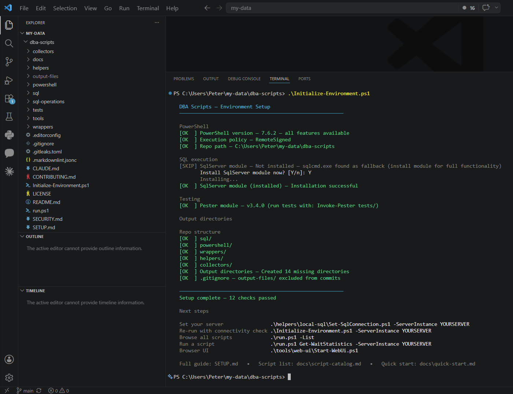
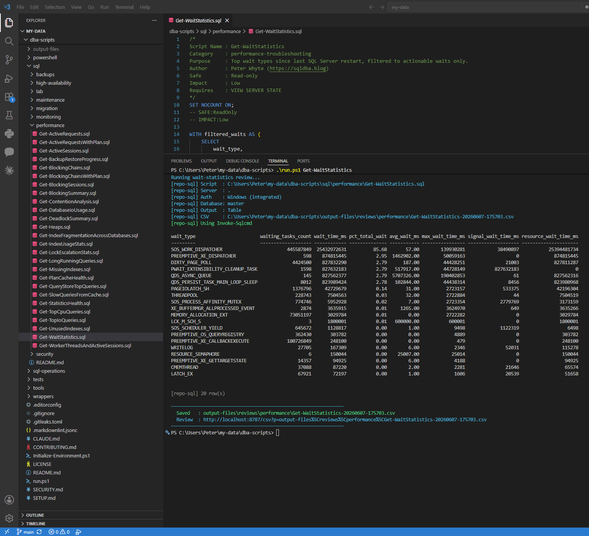
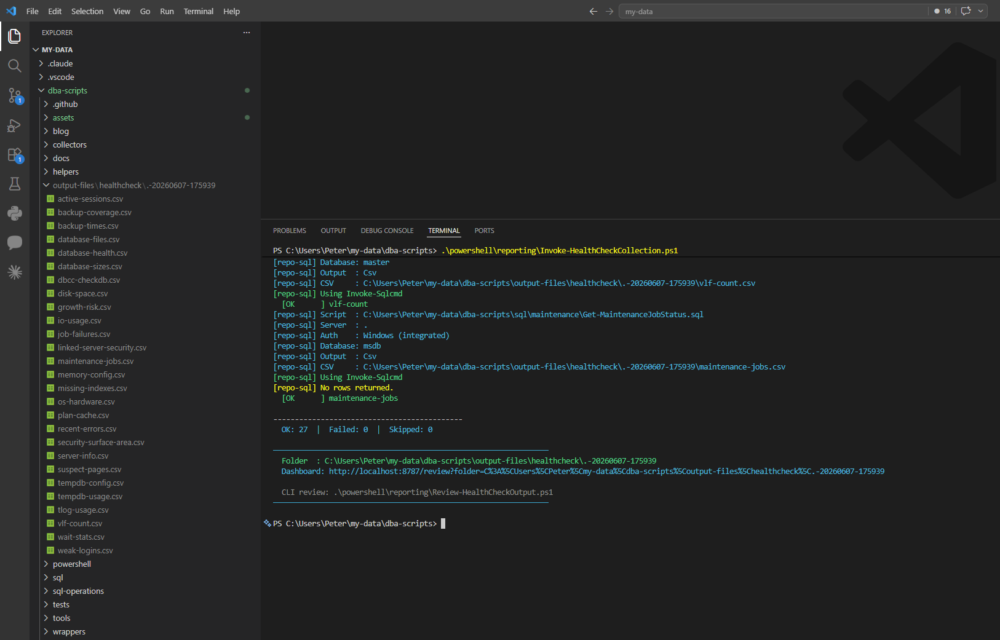
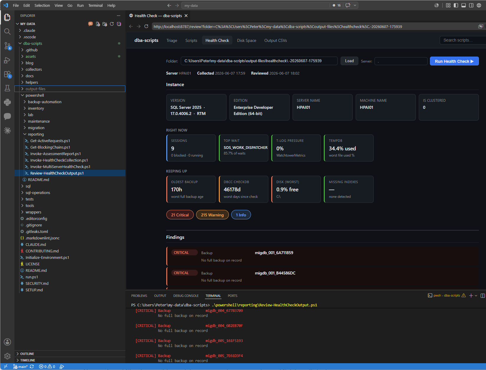

# Quick start

Get from a fresh clone to running diagnostics against a SQL Server instance in five minutes.

---

## 1. Clone and initialise

```powershell
git clone https://github.com/peterwhyte-lgtm/dba-scripts
cd dba-scripts

# Checks PowerShell version, SQL execution tools, and creates output directories
.\Initialize-Environment.ps1

# Full setup — also tests connectivity and sets the session default server
.\Initialize-Environment.ps1 -ServerInstance PROD01\SQL2019
```

<p align="center">
  
  <br><em>Initialize-Environment.ps1 — all checks pass, next steps shown</em>
</p>

The setup script checks everything and tells you exactly what needs fixing. See [SETUP.md](../SETUP.md) for the full prerequisites guide including permissions, modules, and troubleshooting.

---

## 2. Connect to your SQL Server

Set the server once for the session — every script picks it up automatically:

```powershell
# Windows auth (recommended)
.\helpers\local-sql\Set-SqlConnection.ps1 -ServerInstance PROD01\SQL2019

# SQL auth
.\helpers\local-sql\Set-SqlConnection.ps1 -ServerInstance PROD01 -Username sa

# Check what is currently set
.\helpers\local-sql\Set-SqlConnection.ps1 -Show

# Verify connectivity
.\helpers\local-sql\Test-SqlConnectivity.ps1
```

To persist the connection across sessions:

```powershell
.\Initialize-Environment.ps1 -ServerInstance PROD01\SQL2019 -PersistProfile
```

---

## 3. Run your first script

Use `run.ps1` to run any script by name — no paths needed:

```powershell
# Top wait types since last restart
.\run.ps1 Get-WaitStatistics

# Active blocking chains
.\run.ps1 Get-BlockingChains

# Backup coverage across all databases
.\run.ps1 Get-BackupCoverage

# Against a specific server
.\run.ps1 Get-WaitStatistics -ServerInstance PROD01\SQL2019

# Save output to CSV
.\run.ps1 Get-WaitStatistics -OutputFormat Csv
# Output saved to: output-files\reviews\performance\Get-WaitStatistics-<timestamp>.csv
```

<p align="center">
  
  <br><em>.\run.ps1 — resolves any script by name, outputs to terminal or CSV</em>
</p>

Browse all available scripts:

```powershell
.\run.ps1 -List

# Find scripts by keyword
.\helpers\triage\Find-UsefulScript.ps1 -Keyword blocking
.\helpers\triage\Find-UsefulScript.ps1 -Keyword backup
```

---

## 4. Run a health check

Collect all key monitoring data in one pass and review the findings:

```powershell
# Collect 27 scripts, save named CSVs to output-files\healthcheck\<server>-<timestamp>\
.\powershell\reporting\Invoke-HealthCheckCollection.ps1 -ServerInstance PROD01\SQL2019

# Review findings — surfaces CRITICAL / WARNING / INFO
.\powershell\reporting\Review-HealthCheckOutput.ps1
```

<p align="center">
  
  <br><em>Review-HealthCheckOutput — CRITICAL / WARNING / INFO findings across the instance</em>
</p>

What gets flagged: missing backups, stale DBCC CHECKDB, suspect pages, sa enabled, percent-based autogrowth, unconfigured max server memory, high I/O latency, transaction log pressure, and more.

For a scored client report:

```powershell
.\powershell\reporting\Invoke-AssessmentReport.ps1 -ServerInstance PROD01\SQL2019 -AssessedBy "Peter Whyte"
# Output: output-files\assessment\<server>-<timestamp>.md
```

---

## 5. Browse scripts in the web UI

An optional local web interface for browsing, running, and visualising script output:

```powershell
.\tools\web-ui\Start-WebUi.ps1
# Opens http://localhost:8787
```

<p align="center">
  
  <br><em>VS Code terminal (bottom) running Start-WebUi.ps1, browser UI (top) — browse scripts by category, search, and run against any instance</em>
</p>

---

## 6. Run SQL directly in SSMS

Every script in `sql/` is paste-and-run in SSMS. No PowerShell needed:

```sql
-- Open any .sql file from sql/ and paste directly into SSMS
-- Example: sql\performance\Get-WaitStatistics.sql
-- All scripts: read-only, SET NOCOUNT ON, no USE database statement
```

---

## Where to go from here

| Need | Resource |
|------|----------|
| Full script list with descriptions | [docs/script-catalog.md](script-catalog.md) |
| Repo folder layout | [docs/dba-scripts-repo-structure.md](dba-scripts-repo-structure.md) |
| Prerequisites, permissions, troubleshooting | [SETUP.md](../SETUP.md) |
| Migration workflow | `powershell/migration/Invoke-PreMigrationAssessment.ps1` |
| Change orders and runbooks | `sql-operations/` |
| Scheduled trend collection | `collectors/` |
| Multi-server operations | `sql-operations/multi-server-scripts/` |
